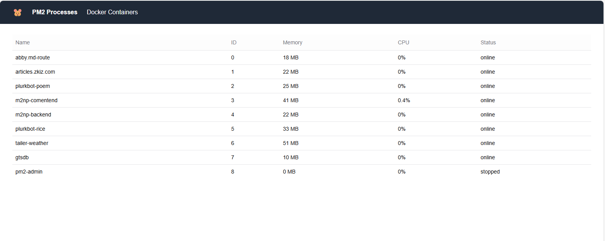
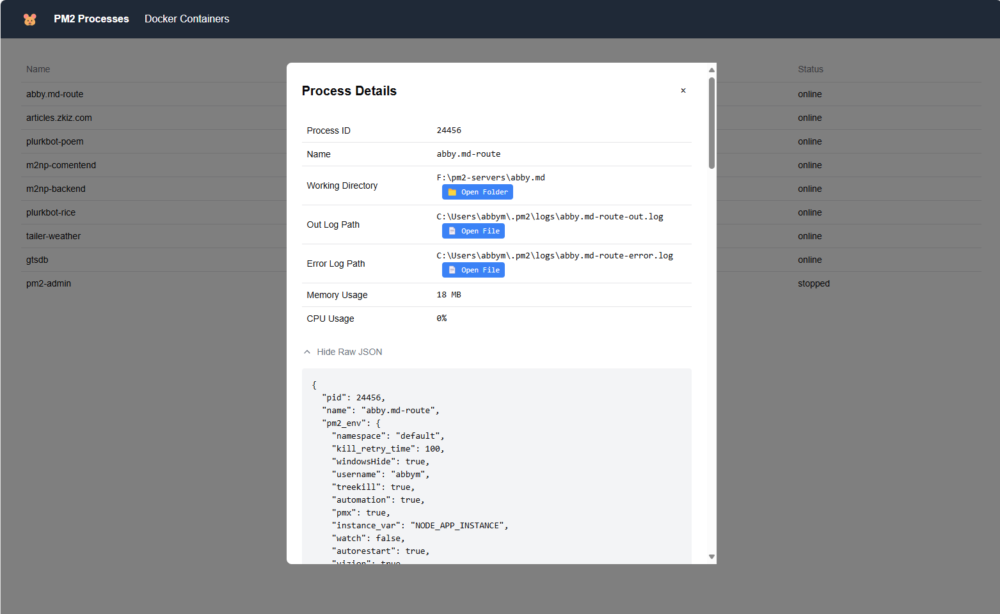
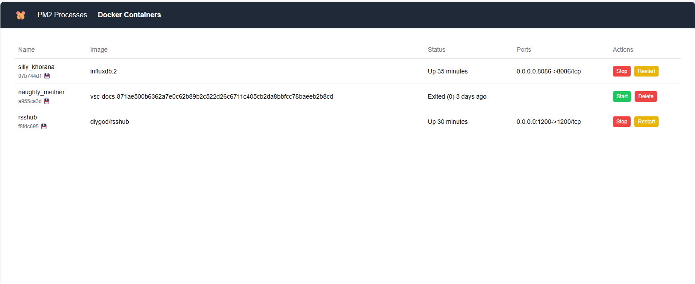
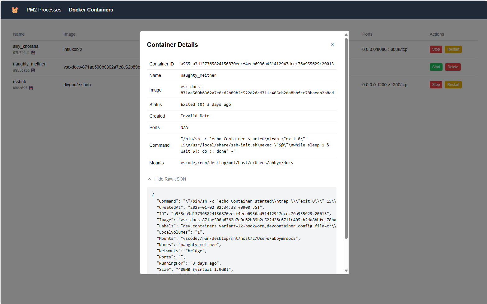

# PM2/Docker Admin

A modern web interface for monitoring and managing PM2 processes and Docker containers with VS Code integration.






## Features

- Real-time monitoring of PM2 processes and Docker containers
- View detailed process information including:
  - Memory and CPU usage
  - Process status
  - Working directory
  - Log file locations
- Docker container management:
  - View container status and details
  - Start/Stop containers
  - Restart containers
  - Remove containers
- Direct integration with VS Code for:
  - 📁 Opening project folders
  - 📄 Viewing log files
- Auto-refresh every 5 seconds
- Raw JSON data view for debugging

## Prerequisites

- Node.js 16.x or higher
- PM2 installed globally (`npm install -g pm2`)
- Docker installed and running
- Visual Studio Code (for file/folder opening features)

## Installation

1. Clone the repository
2. Install dependencies:
```bash
npm install
# or
yarn install
```

# Development

```
npm run dev
# or 
yarn dev
```

Open [http://localhost:13001](http://localhost:13001) to view the admin interface.

## Usage

- The main page displays all running PM2 processes
- Click on any process to view detailed information
- Use the "Open Folder" button to open the process working directory in VS Code
- Use the "Open File" button to view log files directly in VS Code
- The process list auto-refreshes every 5 seconds

## Technology Stack

- Next.js 13+ (App Router)
- React
- TypeScript
- Tailwind CSS
- Shadcn UI Components

## License

MIT
